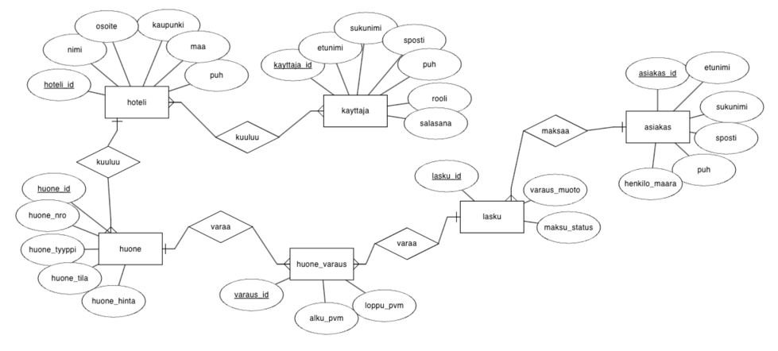
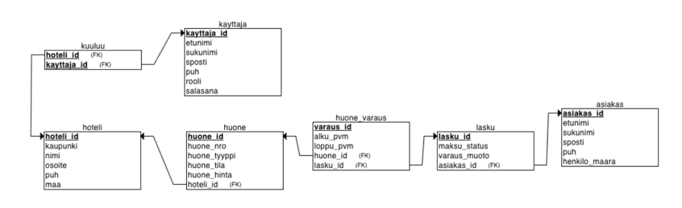
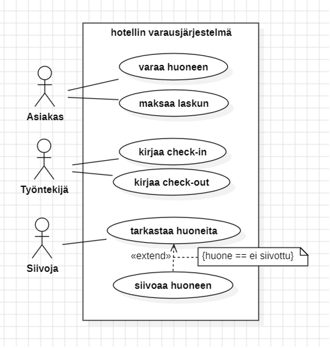
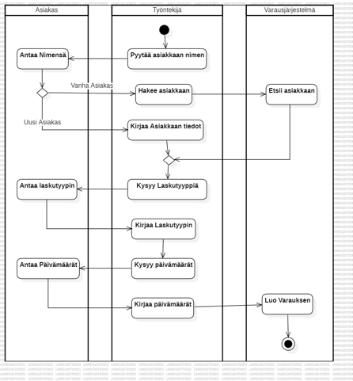

<h2>Hotellin Varausjärjestelmä</h2>

<h3>Ongelman kuvaus</h3>
Tarjoamme käyttäjille, pääsääntöisesti hotellin työntekijöille, viisaan ratkaisun hotellin huoneiden ja varauksien tarkasteluun. Ohjelma pitää kirjaa asiakkaista, varauksista ja huoneista hotelliketjun eri hotelleissa. 
<h3>Kohderyhmä</h3>
Tuotteemme on suunnattu perheille ja aikuisille, jotka etsivät parasta hotellia yöpymiseen matkan tai loman aikana.
<h3>Arvolupaus</h3>
Tuotteemme tarjoaa käyttäjille helpon ja miellyttävän kokemuksen, tarjoten merkittäviä etuja, kuten ajan säästöä, kohdennettuja suosituksia ja helppoa hintavertailua, ylittäen nykyiset ratkaisut.
<h3>Keskeiset ominaisuudet ja toiminnot</h3>
<ul>
  <li>Käyttäjän kirjautuminen ja todennus</li>
  <li>Huoneiden saatavuus ja varaus</li>
  <li>Maksujen käsittely</li>
  <li>Varaushistoria ja käyttäjien hallinta</li>
</ul>
<h3>Tavoitteet ja päämäärät</h3>
Nopea ja helppo tapa nähdä saatavilla olevat hotellihuoneet tietyllä alueella.
Tarjota järjestelmä, joka auttaa asiakkaita löytämään heidän tarpeisiinsa sopivia hotelleja ja auttaa samalla hotelleja löytämään lisää asiakkaita.
<h3>Visio</h3>
Tarjoamme käyttäjillemme parhaan alustan, joka tekee hotellien löytämisestä ja varaamisesta helppoa ja tehokasta. Tavoitteemme on, että käyttäjämme tekevät parhaita mahdollisia majoitusvalintoja ja edistävät positiivisesti matkakokemustaan.

# SuunnitteluKaavat
**ER-kaavio**


**Relational_Schema kaavio**


**Käyttötapauskaavio**


**Activity Diagram**


# Tietokanta
1. **Asenta database management application, esim. Sequel Pro**
1. **Luoda database hotelli_db ja sisältö, koodit löyty: src/main/database/hotelli_db**
2. **Set up the database connection:**
    *lisää xml-file: src/main/resources/META-INF/perisistence.xml*
    ```
    <?xml version="1.0" encoding="UTF-8" standalone="yes"?>
    <persistence xmlns="https://jakarta.ee/xml/ns/persistence"
                 xmlns:xsi="http://www.w3.org/2001/XMLSchema-instance"
                 version="3.0"
                 xsi:schemaLocation="https://jakarta.ee/xml/ns/persistence https://jakarta.ee/xml/ns/persistence/persistence_3_0.xsd">
        <persistence-unit name="hotelli_db" transaction-type="RESOURCE_LOCAL">
            <provider>org.hibernate.jpa.HibernatePersistenceProvider</provider>
            <properties>
                <property name="jakarta.persistence.jdbc.url" value="jdbc:mariadb://localhost:3306/hotelli_db"/>
                <property name="jakarta.persistence.jdbc.user" value="root"/> //vaihda omaksi käyttäjäksi
                <property name="jakarta.persistence.jdbc.password" value="root"/> //vaihda omaksi salasanaksi
                <property name="jakarta.persistence.jdbc.driver" value="org.mariadb.jdbc.Driver"/>
                <property name="jakarta.persistence.schema-generation.database.action" value="none"/>
                <property name="jakarta.persistence.sql-dialect" value="org.hibernate.dialect.MariaDBDialect"/>
                <property name="hibernate.show_sql" value="true" />
            </properties>
        </persistence-unit>
    </persistence>
    ```
   *Lisää luokka: model/datasourse/MariaDbConnection.java*

    ```
    import jakarta.persistence.EntityManager;
    import jakarta.persistence.EntityManagerFactory;
    import jakarta.persistence.Persistence;
    
    public class MariaDbConnection {
    
        private static EntityManagerFactory emf = Persistence.createEntityManagerFactory("hotelli_db");
    
        public static EntityManager getInstance() {
            return emf.createEntityManager();  // Luo uusi EntityManager jokaiselle operaatiolle
        }
    }
    ```
   
3. **Lisää tietokantaan dataa**
    *Lisää luokka: src/main/java/model/dao/InsertData.java*
    ```
    public class InsertData {
        public static void main(String[] args) {
            EntityManager em = MariaDbConnection.getInstance();
            em.getTransaction().begin();
            // Lisää tietokantaan dataa
            em.getTransaction().commit();
            em.close();
        }
    }
    ```

   


   -