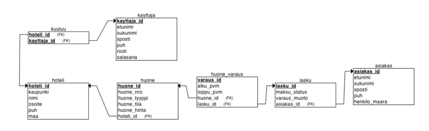

<h2>Hotellin Varausjärjestelmä</h2>

<h3>Visio</h3>
Tarjoamme käyttäjille, pääsääntöisesti hotellin työntekijöille, viisaan ja tehokkaan ratkaisun hotellin huoneiden ja varauksien hallintaan. Ohjelma pitää tarkkaa kirjaa asiakkaista, varauksista ja huoneiden saatavuudesta hotelliketjun eri yksiköissä, mahdollistaen sujuvan ja luotettavan hotellitoiminnan ylläpidon.

<h3>Tavoitteet ja päämäärät</h3>
<ul>
  <li>Tehokkuus ja selkeys: Ohjelma yksinkertaistaa huoneiden ja varauksien hallintaa, tarjoten selkeän kokonaiskuvan hotellin tilasta ja parantaen työntekijöiden tehokkuutta.</li>
  <li>Asiakastietojen hallinta: Tavoitteenamme on varmistaa, että asiakastiedot ovat helposti saatavilla, tarkkoja ja ajantasaisia, jotta hotellin henkilökunta voi tarjota erinomaista palvelua asiakkailleen.</li>
  <li>Huoneiden saatavuuden optimointi: Pyrimme maksimoimaan huoneiden käyttöasteen ja varauskapasiteetin reaaliaikaisen tiedon avulla, mikä auttaa hotelleja tehostamaan liiketoimintaansa.</li>
  <li>Helppokäyttöisyys: Tuotteen käyttöliittymä on suunniteltu helppokäyttöiseksi, jotta hotellin henkilökunta voi nopeasti ja helposti hallita huoneita ja varauksia.</li>
</ul>

<h3>Kohderyhmä</h3>
<ul>
  <li>Hotellin työntekijät: Vastaanoton henkilökunta, jotka tarvitsevat reaaliaikaista tietoa varauksista ja huoneiden saatavuudesta.</li>
  <li>HHotelliketjut: Useita hotelleja hallinnoivat yritykset, jotka haluavat keskitetyn ratkaisun useiden hotellien hallintaan samassa järjestelmässä.</li>

</ul>

<h3>Keskeiset ominaisuudet ja toiminnot</h3>
<ul>
  <li>Käyttäjän kirjautuminen ja todennus</li>
  <li>Huoneiden saatavuus ja varaus</li>
  <li>Asiakastietojen hallinta</li>
  <li>Maksujen käsittely</li>

</ul>

<h3>SuunnitteluKaavat</h3>
<ul>
    <li>
    ER-kaavio</br>
    
    </li>
    <li>'
    Relational Schema</br>
    
    </li>
    <li>
    Käyttötapauskaavio</br>
    
    </li>
    <li>
    Activity Diagram</br>
    
    </li>
</ul>

<h3>Tietokanta</h3>

- **Asenta database management application, esim. Sequel Pro**
- **Luoda database hotelli_db ja sisältö, koodit löyty: src/main/database/hotelli_db**
- **Set up the database connection:**
    - *lisää xml-file: src/main/resources/META-INF/perisistence.xml*
      ```
      <?xml version="1.0" encoding="UTF-8" standalone="yes"?>
      <persistence xmlns="https://jakarta.ee/xml/ns/persistence"
                   xmlns:xsi="http://www.w3.org/2001/XMLSchema-instance"
                   version="3.0"
                   xsi:schemaLocation="https://jakarta.ee/xml/ns/persistence https://jakarta.ee/xml/ns/persistence/persistence_3_0.xsd">
          <persistence-unit name="hotelli_db" transaction-type="RESOURCE_LOCAL">
              <provider>org.hibernate.jpa.HibernatePersistenceProvider</provider>
              <properties>
                  <property name="jakarta.persistence.jdbc.url" value="jdbc:mariadb://localhost:3306/hotelli_db"/>
                  <property name="jakarta.persistence.jdbc.user" value="root"/> //vaihda omaksi käyttäjäksi
                  <property name="jakarta.persistence.jdbc.password" value="root"/> //vaihda omaksi salasanaksi
                  <property name="jakarta.persistence.jdbc.driver" value="org.mariadb.jdbc.Driver"/>
                  <property name="jakarta.persistence.schema-generation.database.action" value="none"/>
                  <property name="jakarta.persistence.sql-dialect" value="org.hibernate.dialect.MariaDBDialect"/>
                  <property name="hibernate.show_sql" value="true" />
              </properties>
          </persistence-unit>
      </persistence>
      ```
    - *Lisää luokka: model/datasourse/MariaDbConnection.java*

      ```
      import jakarta.persistence.EntityManager;
      import jakarta.persistence.EntityManagerFactory;
      import jakarta.persistence.Persistence;
      
      public class MariaDbConnection {
      
          private static EntityManagerFactory emf = Persistence.createEntityManagerFactory("hotelli_db");
      
          public static EntityManager getInstance() {
              return emf.createEntityManager();  // Luo uusi EntityManager jokaiselle operaatiolle
          }
      }
      ```

<h3>Sovelluksen käyttöönotto</h3>
<p>
  Käyttääksesi sovellusta, seuraa näitä ohjeita:
</p>
<ol>
  <li>Cloonaa tämä repository omalle koneellesi.</li>
  <li>Aja <code>database</code>-kansiossa oleva tietokannan luontiskripti tietokannan luomiseksi sovellusta varten.</li>
  <li>Käynnistä sovellus painamalla "Run" tiedostosta <code>Main</code>.</li>
</ol>

<h3>Sovelluksen käyttö</h3>
<p>
  Kun sovellus käynnistyy, käyttäjällä on mahdollisuus kirjautua sisään. Jos käyttäjällä ei ole tunnuksia, hän voi siirtyä rekisteröintiin.
  Rekisteröinnin jälkeen käyttäjä voi kirjautua sisään ja aloittaa sovelluksen käytön.
</p>

<h4>Sivut ja niiden toiminnot</h4>
<ul>
  <li><strong>Etusivu:</strong> Näyttää yleiskatsauksen hotellista ja saatavilla olevista toiminnoista.</li>
  <li><strong>Asiakassivu:</strong> Näyttää ja hallinnoi asiakkaiden tietoja.</li>
  <li><strong>Check-in:</strong> Sisäänkirjautuminen hotelliin.</li>
  <li><strong>Check-out:</strong> Uloskirjautuminen hotellista.</li>
  <li><strong>Huonesivu:</strong> Näyttää hotellihuoneiden tiedot ja tilan.</li>
  <li><strong>Varaussivu:</strong> Hallinnoi asiakkaiden varauksia.</li>
  <li><strong>Admin-sivu:</strong> Saatavilla vain admin-käyttäjille, joiden rooli on määritelty tietokannassa.</li>
</ul>

<h4>Admin-oikeudet</h4>
<p>
  Admin-nappi ja -ikkuna näkyvät vain käyttäjille, joilla on admin-oikeudet tietokannassa. Ensimmäinen admin-käyttäjä täytyy asettaa manuaalisesti.
  Admin-käyttäjä voi lisätä uusia admineja, muokata käyttäjätietoja ja poistaa käyttäjiä.
</p>


